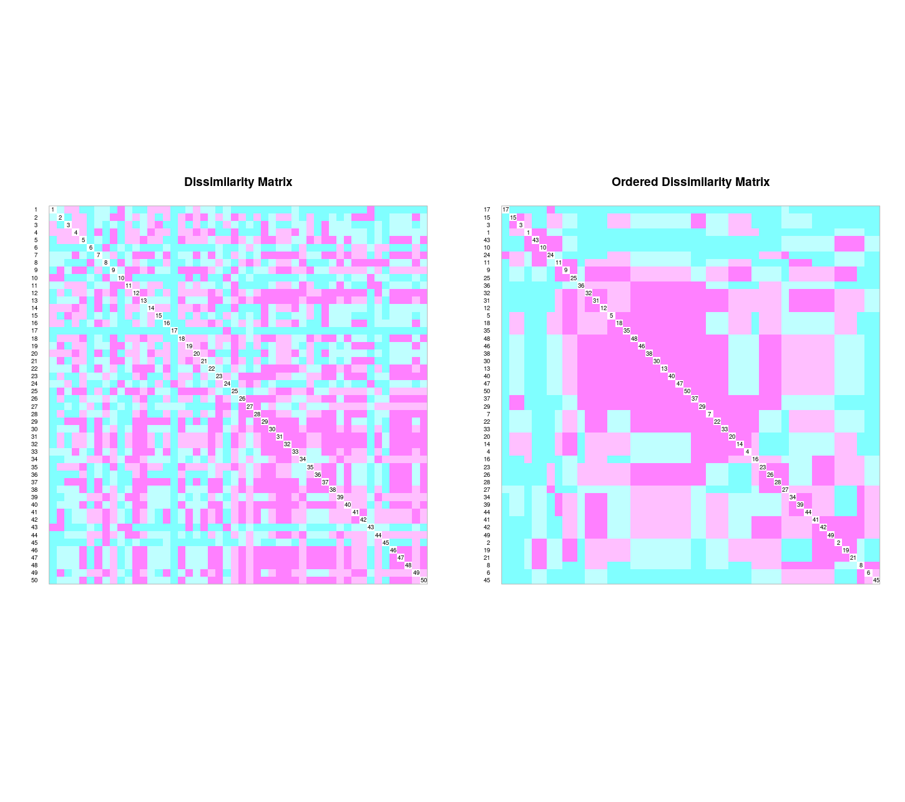

```{r, include=FALSE}
source("análisis.R", local = knitr::knit_global())
```


# Introducción

 Los censos o estudios de diversidad y abundancias de familias o especies  (fauna/flora) son de suma importancia, ya que  nos ayudan a obtener información, recopilarla, analizar, comparar y evaluar datos que pueden ser publicados o usados como referencias para fines de investigación futura. También nos permite estudiar y conocer tasa de mortalidad, crecimiento, distribución, diversidad ecológica de la población censada, diversidad. Así mismo, los censos  pueden servir de insumo para profundizar en estudios sobre la ecología de la comunidad, tales como: asociación de variables ambientales y su relación con patrones espaciales/temporales (e.g. influencia de la edafología y la geomorfología en la abundancia y distribución de especies),así como para conocer y tratar de entender comportamientos de especies raras, entre otros aspectos. 
 
 La isla Barro Colorado, ubicada en el canal de Panamá, monumento natural protegido desde 1997, posee las condiciones perfectas para un sin número de estudios orientados a la flora o la fauna de dicho lugar, esto combinado con las facilidades que el Instituto Smithsonian de Investigaciones Tropicales o STRI por sus siglas en inglés, ofrece para los investigadores que deciden estudiar la isla, hacen una combinación perfecta.
 Se han realizados diferentes estudios, algunos para probar la la hipótesis de perturbación intermedia [@hubbell1999light], dinamica de bosque en esta zona [@condit1999dynamics], dinamica de biomas, entre otros interesantes estudios [@meyer2013detecting].

  Euphorbiaceae es una familia cosmopolita,  aunque con mayor concentración en regiones tropicales, (Heywood, 1985),a menudo se le cita como una evolución convergente de las cactáceas por el parentesco que algunas especies presentan con esta familia.
Las Euphorbiaceae presentan una variedad de 17 modelos de crecimiento según los modelos de Halle, presentan características únicas, como una estructura que recubre las semillas de esta familia dejando fuera la idea de origen polifilético de las Euphorbiáceas (@vester2002modelos).


En este trabajo, se analiza la familia Euphorbiaceae en Barro Colorado desde la perspectiva de abundancia, riqueza, distribución y determinación de patrones, específicamente su diversidad de especies, patrones espaciales y ordenación.
Para lograr esto, nos apoyaremos en datos que ofrece BCI, en especial, ecología numérica de las plantas. 
El objetivo es contribuir al conocimiento de la ecología de las Euphorbiaceae, específicamente a sus patrones de su distribución y factores ambientales.


 
\ldots

# Metodología

Los datos en los que se basa este trabajo se recopilaron por un grupo de investigadores en la Isla Barro Colorado 2010; trabajo que se inició hace 40 años (referencia de la fecha actual 2020), y solo presenta una pequeña porción de los inconmensurables estudios que se pueden llevar a cabo en este lugar. Realizaron un estudio de monitoreo a largo plazo de una parcela de bosque tropical de gran tamaño.

Según @condit1998tropical procedieron a montar una parcela dividida en 50 hectáreas. Esta posee alrededor de 250 mil tallos de unas 300 especies diferentes,  al cual se les sumó el censo de lianas que hasta el 2010 se conocían  56 mil individuos de unas 180 especies.
Cada uno de los árboles en esta zona determinada que sobrepasan  10 mm de diámetro será medido, marcado, mapeado y recensado cada 5 años con técnicas estandarizadas dispuestas a cualquier ciencia que quiera hacer uso de estas.
La clave es que los datos sean comparables, una vez reunidos a través de  técnicas estandarizadas en diferentes sitios, ya sea que se refieran a grandes distribuciones, secuencia de ADN o crecimiento de árboles. [@condit1998tropical].

Los datos empleados en este trabajo, proceden de BCI la cual fue creada con la intención de examinar teorías ecológicas sobre el mantenimiento de una alta diversidad de especies (@condit1995mortality).

El análisis exploratorio de la abundancia y la riqueza, tanto para todas las familias de BCI, como de manera específica para Euphorbiaceae, se realizó empleando mapas de distintas variables y paneles de correlación; en estos últimos se emplearon tanto el índice de correlación de Pearson como el de Spearman, y se evaluó la significación de la correlación por medio de la prueba 'producto momento', fijando como nivel de significancia un alpha=0.05.

La organización de la parcela de 50 hectáreas se proyectan en el siguiente mapa que incluso toma en cuenta la elevación. (Ver figura \ref{fig:mapa_cuadros}) 
 


 
 
Con relación a la interpretación de las matrices, se tomó en cuenta la distancia entre los sitios, dígase la disimilaridad (a mayor distancia, mayor disimilaridad), la cual se representa usando la métrica de la distancia euclídea, lo que equivale a una matriz de comunidad transformada, en este caso a una matriz de Hellinger, ésta se representará de forma gráfica en un mapa de calor con diversos colores, el 1er mapa no representa ningún orden, mientras que el 2do sí, facilitando así determinar patrones o grados de asociación.
 

\ldots

# Resultados


La familia Euphorbiaceae estuvo representada por 10 especies y un total de 2421 individuos. 
La más rara, es decir, la menos abundante, fue  *Alchornea latifolia*, con un solo individuo, seguida de *Sapium broadleaf* con dos individuos. La más abundante fue *Acalypha diversifolia*, con 1023 individuos (ver tabla \ref{tab:tabla_de_abundancia} y figura \ref{fig:abun_sp_q}). La distribución de la riqueza y la abundancia por sitios es desigual, con 6 especies y ca. 50 individuos en promedio por cuadros de 1 Ha. Los valores mínimo y máximo de riqueza y abundancia por sitios muestran que se trata de una familia con mucha variabilidad en la parcela; en los cuadros 10, 17 y 43 se registraron tan sólo tres especies, mientras que en los cuadros 29 y 37 se registraron 8. Asimismo, la abundancia por cuadros fue muy variable, registrándose en el cuadro 2 el valor de abundancia mínima de 7 de individuos y un máximo de 162 individuos en el cuadro 50.

```{r, echo=FALSE}
knitr::kable(abun_sp,
             caption = "\\label{tab:tabla_de_abundancia}Abundancia por especie de la familia Euphorbiaceae")
```

## Riqueza y abundancia
La distribución de la abundancia de especies por cuadros de 1 Ha fue inhomogénea (ver figura 2). Tanto las especies comunes (e.g. Acalypha diversifolia, Croton billgergianus) como las de abundancia intermedia (e.g. Sapium glandulosum, Acalypha macrostachya), se distribuyeron de manera desigual a lo largo de la parcela.
*Acalypha diversifolia* ,  es la especie más abundante ya que  registró un muchos individuos por cuadros de esta especie seguido de *Croton billbergianus*.
Un dato más que nos arroja esta tabla es que estas mismas especies pueden coexistir ya que se les ve en algunas cuadrículas en las que ambas coinciden con una alta cantidad de individuos, estas cuadrículas corresponden a la 23 y a la 50, mismas que poseen la mayor riqueza global de la parcela (ver figura \ref{fig:cuadro_riqueza_global})Todo esto nos guia no solo a ver la riqueza por individuo sino que también por familia.

```{r, echo=FALSE, fig.cap="\\label{fig:abun_sp_q}Abundancia por especie por quadrat.La gráfica representa la abundancia (celdas coloreadas en tonalidades de rojo) de las especies de Eurphorbiaceae (ordenada) por cuadros de 1 Ha de BCI (abscisa), a la izquierda esta la lista de especies y a mayor intenso el color de la cuadricula, mayor es el numero de individuos"}
abun_sp_q
```

Las variables riqueza y abundancia de especies, tanto a nivel global (todas las familias de plantas representadas en BCI) como respecto de Euphorbiaceae, presentan un patrón espacial aglomerado, en algunos casos insinuando el mismo patrón de distribución de determinadas variables ambientales.

Concretamente, la riqueza de especies de BCI se hace máxima en las celdas 23 y 50 (195 y 193 especies),  con valores también altos en sus vecinas. Respecto de la familia Euphorbiaceae, la riqueza de especies es máxima en las celdas 29 y 37 (8 especies cada una), con valores también altos en cuadros vecinos. En el análisis exploratorio no se detectó correlación de la riqueza de especies de esta familia con ninguna de las variables ambientales.

La abundancia sigue un patrón también aglomerado, pero distribuida de diferente manera que la riqueza. Las celdas del borde noroccidental, con valores que oscilan entre 4500 y 5000 individuos de especies de distintas familias (ver figura \ref{fig:cuadro_riqueza_global}), forman un aglomerado de la abundancia. Por otra parte, la abundancia de especies de la familia Euphorbiaceae, mostró un patrón espacial similar al de la riqueza de especies de BCI, siendo máxima en las celdas 23 y 50 (147 y 162 especies), con valores de abundancia también altos en sus vecinas. Este grado de concordancia espacial entre la abundancia de especies de Euphorbiaceae y la riqueza global de plantas de BCI, resultó también respaldado por una correlación significativa (r=rho=0.55, p<0.01). Adicionalmente, la abundancia de especies de esta familia presentó relación directa con determinadas variables ambientales, como el hierro, la pendiente media y la heterogeneidad ambiental, y relación inversa con el porcentaje de morfología de valle registrado en los cuadros. (ver figura \ref{fig:cuadro_riqueza_global}). 

Esto abre una puerta a más variables determinantes  que influyen el la presencia, distribución y riqueza de las especies,esto se debe a que la variación del relieve, tipo de vegetación, influye directamente el clima, humedad, suelo, temperatura y muchos más factores que son imprescindibles para la presencia de ciertas especies, esto aplica para todo ser vivo, no de forma exclusiva a Euphorbiaceae. (ver figura \ref{fig:cuadro_de_riqueza_familia})

{width=50%}


{width=50%}

Comparando la abundancia global de nuestra familia de trabajo con la abundancia global de especies podemos notar lo siguiente, existe una asociación entre la abundancia global de especies y la abundancia global de Euphorbiaceae y la inclinación, ya que las cuadrículas con mayor cantidad de individuos también están situadas en la parte noroeste de la parcela y la parte este también.(ver figura \ref{fig:cuadro_de_abundancia_global})

{width=90%} 

En cuanto a la abundancia de Euphorbiaceae, la cuadrícula 50 es la que posee mayor cantidad de individuos seguido de la número 23 que se ubica en la parte céntrica de la parcela con 147 individuos. En el mapa de abundancia global se muestra el mismo patrón(ver figura \ref{fig:cuadro_de_abundancia_global}),donde la cuadrícula 28 también situada de forma céntrica, es una de las cuadrículas con más individuos, 4,436 para ser exactos, lo que me permite llegar a la conclusión que la abundancia global de  Euphorbiaceae está asociada a la inclinación del relieve  y la abundancia global de especies.
Puede que haya un tercer factor ( altitud, nutrientes, tipo de suelo,microclima,etc) que determine la alta presencia de especies en esta zona y a la vez la alta presencia de Euphorbiaceae.(ver figura \ref{fig:cuadro_abundancia_de_mi_familia})

{width=85%} 
  
En el análisis de correlación de la riqueza y la abundancia de Euphorbiaceae, sólo se detectó un patrón destacable: el contenido de hierro del suelo presenta relación positiva y significativa con la abundancia, no así con la riqueza. Son igualmente destacables, las significativas asociaciones negativas y positivas que existen entre distintas variables de suelo, aunque es común que múltiples variables de suelo interactúen entre sí. (ver figura \ref{fig:suelo_ph_abun_riqu}) 
  

  
Viendo la riqueza y abundancia desde una perspectiva de heterogeneidad ambiental, según Pearson tomando en cuenta la geomorfología y los que observamos es que hay variables como la elevación o la pendiente media  que muestran asociación con muchas de las variables del análisis, pero los aspectos que nos interesan son relación entre la abundancia y riqueza de Euphorbiaceae con las demás variables del análisis, y como resultados tenemos que la abundancia de Euphorbiaceae 
muestra asociación con la riqueza global de especies, al igual que con la pendiente media, geomorfología del valle y la heterogeneidad ambiental, mientras que la riqueza de nuestra familia solo muestra relación con con la heterogeneidad ambiental y a diferencia de la abundancia no muestra relación alguna con la riqueza global.(Ver figura \ref{fig:geo_pearson})
  

  
Pero desde la perspectiva de Spearman sólo la abundancia de nuestra familia es la que muestra relación con las mismas variables que resaltó el análisis de Pearson: riqueza global, geomorfología valle y heterogeneidad ambiental aunque muchas de las variables geomorfológicas muestran asociación entre sí.(ver figura \ref{fig:spearman})


##MEDICIÓN ASOCIACIÓN

El análisis estadístico de la asociación (relación, covarianza, correlación) entre variables representa una parte básica del análisis de datos en cuanto que muchas de las preguntas e hipótesis que se plantean en los estudios que se llevan a cabo en la práctica implican analizar la existencia de relación entre variables (@molina2009t), que es lo que veremos a continuación aplicado a nuestra familia. 

La matriz de distancia euclídea calculada a partir de la matriz de comunidad transformada por el método de Hellinger, revela que existen al menos tres clusters claramente diferenciados. Un clúster grande integrado por al menos 17 sitios (e.g. sitios 25, 32, 33, 37, 50). Un segundo cluster más pequeño de unos 4 sitios  (e.g. 10,8,42,49) y un tercer cluster compuesto por las cuadrículas 36,28,45,6, entre otras. (ver figura \ref{fig:diss_hellinger})


La zona de trabajo muestra un 91.7% de similaridad o especies compartidas, dándonos a entender que la riqueza de especies por cuadrícula es bastante homogénea. 
Analizando la similaridad de Jaccard para datos binarios (presencia/ausencia), lo que más resalta a primera vista es un gran cluster formado por sitios digos un tanto aleatorio (e.g.4,7,,18,20,29,30,35,37,38), y los sitios ubicados entre el 46 y el 50. Estos guardan especies compartidas haciéndolos sitios semejantes, en otras palabras son sitios con poca disimilaridad en cuanto a sus especies compartidas. Recordemos que a mayor distancia mayor disimilaridad,  lo que significa que desde el punto de vista de Jaccard son muy parecidos y es interesante, ya que si observamos los números, no todos los sitios de ese primer cluster están de forma continua en el mapa y aun asi son similares. Algunos de estos puntos también coinciden  según Hellinger y puedes observar en la matriz anterior a esta, la matriz de Hellinger siendo así importante el patrón entre las figuras de las matrices 10 y 11. Si seguimos observando, hay clusters más pequeños, los puntos 41,42,49,2,19 y 21 son parecidos entre sí teniendo poca disimilaridad, también los sitios 1,43,10 y 24. (Ver figura \ref{fig:diss_jaccard})



Analizando la heterogeneidad ambiental basándonos en la topografía de la zona, desde una matriz mixta, cuyas variables sean  los tipos de bosques(Old High;bosque viejo en relieve alto, Old Low;bosque en vertiente baja, Old Slope;bosque relieve bajo, Swamp;bosque en área encharcable y Young;bosque joven), el tipo de hábitat y quebrada,presencia o ausencia de cañada (tabla de 3 columnas en nuestro script de análisi),  para determinar qué tan homogénea es la distribución de los microhabitats en la parcela, podemos decir que los resultados interpretados en base a la columna en el script y la matriz son:
Los niveles de heterogeneidad con respecto a microhábitat son bajos y pueden ir desde 0.0000 a 0.6368, lo que nos dice que existe una gran homogeneidad entre las microhábitat las hectáreas.
Con relación al hábitat, los más escasos son Swamp o bosque en área encharcable y Young o bosque joven, en 1ro solo se encuentra en las cuadrículas 23 y 18 lo que resulta razonable ya que ambas posiciones están contiguas de forma longitudinal en la parcela, mientras que young o bosque joven está en las cuadrículas 30 y 35 que al igual que la anterior, están de formas continuas de forma longitudinal(el 23 a la derecha del 15), puedes visitar la referencia 1 donde muestra la organización de la parcela por hectárea y ubicar estos puntos para entender mejor.(Ver figura \ref{fig:mapa_cuadros})

Las cuadrículas que coinciden con Old Slope son: cuadrícula 1,5,16,21,26,36,41,42,43,44,45,46 y 50. Las cuadrículas 1 y 5 están en extremos opuestos, la 16 y 21 están contiguas de forma horizontal, lo mismo pasa con la 26 y 36 aunque estas tienen la cuadrícula 31 de por medio que posee un tipo de bosque diferente a estas, old low para ser específicos, las 41,42,43,44,45 forman una una línea vertical con respecto a la hectárea teniendo a las cuadrículas 46 y 50 en cada extremo de esta línea, también resaltar que en las cuadrículas 1 y 50 hay presencia de quebrada.
Tipo de bosque Old High está presente en las cuadrículas 29,32,33,34,37,38,39 y 40, desde la 32 a la 34 están posicionadas de forma vertical, esta última con la 29 a su derecha y desde la 37 a la 40 también formas una línea vertical con respecto a la parcela. Swamp (bosque en área encharcable) y  Young (bosque joven) fueron los dos tipos de bosques con menor frecuencia, el primero presente en los sitios 23 y 10 y el segundo solo en los sitios 30 y 35.
EL tipo de bosque más abundante fue 0ld low, tipo de bosque en vertiente bajo quebrada, presente en 26 de los 50 sitios y Swamp junto a Young fueron los menos abundantes, cada uno presente en 2 sitios.

Debemos recordar que tanto la abundancia como la riqueza de nuestra familia está asociada a la heterogeneidad ambiental según la correlación de Pearson y que no hay tanto cambio brusco de tipo de bosque por sitio.
Esta matriz nos ayuda a entender el grado de diversidad *beta* que está presente en las cuadrículas, en este caso esta diversidad se muestra muy homogénea para los Old slope, Old low y Young, ya que muchos de los sitios con este tipo de bosque estas geográficamente contiguos, donde no veríamos la diversidad *beta* sería en Swamp ya que los sitios con este tipo de bosque no están de forma continua como para realizar comparación alguna al igual. (Ver figura \ref{fig:punt_z})


Al analizar la heterogenidad  a través de una matriz transpuesta  usando datos de abundancia, para ver la posible asociación o patrones,tomando en cuenta que estos datos también se analizaron mediante la *Correlacion de Pearson*, usando una matriz de comunidad en modo R, donde dicha matriz se convirtió en datos binarios  y los resultados  "brutos" que arrojó mostraron consistencia, de los cuales obtuvimos que: las especies relacionadas entre si están formando un único cluster compuesto por *Hieronyma alchomeoides*, *Croton billbergianus*, *Acalypha diversifolia*, *Hura crepitans*, *Alchornea costaricensis* y *Sapium glandulosum*. Algo interesantes es que estas últimas dos mencionadas pertenecen al cluster y pueden coexistir con las demás especies del cluster, pero no muestran asociación la una de la otra.
*Acalypha macrostachya* solo muestra una cierta relación con *Alchornea costaricensis* siendo la que menor distancia guarda entre especies no sitio y aún más leve con *Sapium broadleaf*, mientras que *Alchornea latifolia*  no muestra asociación o cercanía con las demás especies, siendo así de las que más distancia muestra con relación a las especies.
Algo para entender mejor este patrón, es si lo viéramos desde la perspectiva de una correlación de nutrientes y variables de suelo. (Ver figura \ref{fig:asoc_esp_no_sitio})


##Ordenación no restringida


Es importante ver si el ph y otros  elementos del suelo se correlaciona con nuestras especies, y esto podemos hacerlo a través de análisis de  PCA o análisis de componentes principales, CA o análisis de correspondencia y PCoA o análisis de coordenadas principales, cada una sus siglas en inglés.Estos nos servirán para ver el grado de asociación que guardan los sitio y elementos del suelo. Debemos recordar que la ordenación se basa también en la similaridad  y que su principal propósito es procurar reducir la dimensionalidad de los datos a través de un conjunto de técnicas, como representar datos en ejes ortogonales (comúnmente dos),donde el eje 1 explica la mayor varianza, el eje n explica la mínima, etc.


Comencemos por PCA en un modelo de vara quebrada, pero antes aclarar que la ordenación en este caso también se basa en la similaridad  y que su principal propósito es procurar reducir la dimensionalidad de los datos a través de un conjunto de técnicas, como representar datos en ejes ortogonales (comúnmente dos),donde el eje 1 explica la mayor varianza(la mayor cantidad de varianza posible en el menor número de ejes), el eje n explica la mínima, etc en este todas nuestras variables son  numéricas y comparables en cuanto a la escala de medición se refiere. los resultados obtenidos a través de este análisis de componentes principales son los siguientes: (ver figura \ref{fig:PCA_1})


Nuestro análisis de componente principal aplicado a la matriz de suelo nos dice que el componente PC1 es importante y el resultado que nos arroja es más de lo que se podría esperar para un modelo de vara quebrada, un poco más que el doble, y que aporta suficiente varianza para nuestra matriz, a diferencia de los demás componentes que no sobrepasan la vara quebrada lo que nos indica que esos componentes son pocos útiles ya que no consiguen explicar lo suficiente.

Viéndolo desde otra perspectiva, digase desde un Biplot, la correlación se vería de esta forma: Podemos interpretar los datos de la siguiente manera: la distancia euclídea está preservada en el escalamiento 1 y pH, P y N son los componentes de suelo más abundantes en este escalamiento, estos contribuyen mucho más en los componentes 1 y 2 y que en el resto de los componentes,dígase poco equitativo, mientras que los demás elementos o descriptores tiene una contribución para los demás los componentes más o menos homogénea para cada uno de los sitios . En el escalamiento 2 (distancia de Mahalanobis), el pH y el Nitrógeno guardan una relación con los sitios 31,35,3637,38,39,40, mientras que , minerales como el hierro (Fe) y el aluminio (Al),  están presente en casi el 50% de los sitios, siendos así muy parecidos en términos de suelo(negativo). Otros puntos a resaltar son que los elementos Cu, Mn, Fe están muy asociados, al igual que K y Zn, Ca,Mg Y N.min. lo que significa que cuando uno crece el otro también, a diferencia de B y Al o de P y Fe que cuando uno crece el otro disminuye porque no guardan relación entre sí en otras palabras una relación inversa. (ver figura \ref{fig:Biplot_pca1_pca2})


Aunque las escalas son diferentes, podríamos decir que el patrón se mantiene en ambos escalamientos ya que se presenta un agrupamiento de 3 cluster en ambos Biplot.
aquí puedes ver un el conjunto de cluster en función de los mismos datos de suelo, esta consistencia resulta razonable aunque los métodos de ordenación no sean los mismos ya que ambos se basan en la distancia euclídea. (ver figura \ref{fig:cluster_pca})


Si aplicaramos en análisis de PCA para especies y no para variables obtendremos ;lo siguiente:
Nuestro modelo de vara quebrada quedaría de la siguiente manera: el componente 1 a diferencia que el de datos de suelo,este  tiene poco más de lo que se podría esperar para el modelo de vara quebrada, lo mismo pasa con el 2do componente pero en los demás no, siendo estos dos primeros imprescindibles para el análisis de la matriz de comunidad.Aun asi se podrian usar las primeras 4 o 5 componentes para una mayor comprensión. (ver figura \ref{fig:quebrada_especie})


Viéndolo desde la perspectiva de diagrama de escalamiento o biplot, obtendremos lo siguiente: (ver figura \ref{fig:biplot_especie})


Es de esperarse que los patrones no coincidan con el diagrama de escalamiento anterior o biplot, y esto es porque las variables que se están tomando en cuenta son diferentes. Anteriormente se usaban elementos de suelo como descriptores y en este caso las especies de nuestra familia Euphorbiaceae. 
Podemos ver que *Acalypha diversifolia* (Acaldive), junto a *Croton billbergianis* (Crotbill) y *Adelia triloba* (Adeltil), son las especies menos equitativas en los sitios de muestreo, cabe destacar que estas son más especialistas, mientras que las especies cuyos vectores no sobresalen de la circunferencia, con más generalistas.


Si correlacionar ambos análisis de PCA, tanto el de variables ambientales y suelo con el de las especies obtenemos los siguiente: la especie *Croton billbergianis* posee una estrecha relación con el aluminio, *Hura crepitans* (Huracrep) con el Nitrógeno, *Acalypha diversifolis* también muestra cierta relación con el potasio (K); los elementos pH, N, B, Y K poseen una estrecha  relación entre sí, especialmente el B y el pH. mientras que el K y el Al tienen una relación inversa. (ver figura \ref{fig:suelo_especie})


Si usamos solo las variables numéricas, obtendremos lo siguiente:
N, Ph, K, Al y B, siguen siendo variables significativas que pueden explicar la distribución de especies, a las cuales se les suma Zn y Cu.
También las coordenadas UTM de este a oeste (UTM.EW) junto la  riqueza global se consideran variables significativas. En cuanto a la riqueza global, se refiere al  número de especie total por cuadro,la cual  está asociado a la matriz de comunidad como ya mencionamos, lo que significa que cuando aumenta el número de especies, este puede ayudar a interpretar cómo se distribuyen las especies dentro de la matriz de comunidad, dato que se manifestó al principio en la correlación de Pearson.(Ver figura \ref{fig:geo_pearson} Correlación de Pearson) (ver figura \ref{fig:variables_numericas})

 
 
Una vez visto este análisis, pasemos al CA, análisis de correspondencia, este es uno de los más usados y trata de llenar el vacío de las limitaciones del PCA ya que este nos permite usar datos de conteos aunque el CA no se puede aplicar a datos que no sean de frecuencias ya sea de abundancia o de presencia ausencia y no es necesario transponer las matrices. Está bien  mencionar que en este análisis no trabajamos con distancia Euclídea sino con la distancia ji-cuadrado.

Las distancias no van a coincidir del todo ya que se usan parámetros diferentes pero de todas formas puede que resalten patrones ya vistos en casos anteriores.
El escalamiento 1 muestra la distancia en función de sitios y el 2 la relación o distancia en función de especies.

Comencemos con el modelo de vara quebrada de nuestro CA, en este caso los componentes CA2 y CA3, son los que podrían representar la matriz de comunidad a diferencia de los demás modelos de vara quebrada donde el componente 1 era el más explícito a nuestra matriz de comunidad.De todas formas podemos usar las 4 primeras componentes para entender nuestra matriz de comunidad y de esa forma entender y resumir el conjunto de las multidimensiones de nuestra matriz de comunidad. Esto lo veremos mejor explicado en los siguientes gráficos. (ver figura \ref{fig:AC})


Nuestros biplot del análisis de Correspondencia nos dicen lo siguiente: no tenemos vectores, en este caso solo hay espacios comunes que muestran la distribución y asociación. El biplot 1 o CA1 nos servirá para entender la similitud entre sitios y viendo el gráfico nos dice que un alto porcentaje de los sitios están más que relacionados,esto suele pasar cuando nuestras especies no suelen ser tan especialistas, no presentan patrones o tendencia muy clara. Hay unas 4 especies que rompen este patrón: *Adelia triloba*, *Alchornea latifolia*, *Acalypha macrostachya* y *Sapium broadleaf*, en especial las dos últimas, dándonos a entender que son especies algo más especialistas y de poca abundancia, esto podemos evidenciarlo en la tabla de de abundancia de especie por cuadrícula. (ver figura \ref{fig:abun_sp_q})


El biplot 2 nos servirá para ver la distancia entre especies, obtuvimos lo siguiente:
coincidiendo con el número 1, las especies guardan una cercanía considerable, dando a entender que su patrón de distribución podría ser homogéneo, aunque al igual que en el 1er biplot las especies *Adelia triloba*, *Alchornea latifolia*, *Acalypha macrostachya* y *Sapium broadleaf*, guardan una mayor distancia con relación al resto, en especial las dos últimas, evidenciandola consistencia entre los análisis.Las demás especies, por motivo de la estrecha distancia ji-cuadrado, nos indica que están correlacionadas entre sí.

En ambos biplots, *Croton billbergianus* guarda cierta distancia con relación a sitios y a especies, más en el 1er biplot que en el 2do, pero no tanto como las especies antes mencionadas. (ver figura \ref{fig:biplot_ca})

 

Siguiendo con el  PCoA o análisis de componentes principales en espa;ol, este no usa la distancia euclídea ni la ji-cuadrada, lo que puede resultar algo incómodo ya que esto nos resultara en vectores de magnitudes negativas, imaginarias, dígase un vector complejo.Dicho vector no se podrá  aprovechar o representar como tal en el análisis de coordenadas principales porque no se podrá representar en los ejes del análisis.

Viendo los resultados de nuestro PCoA en el cual incluimos variables ambientales y geomorfológicas, obtenemos lo siguiente: las especies que muestran una contribución directa a sitios son, *Sapium broadleaf*  que contribuye a los sitios 36,24,43 y 45, *Alchornea latifolia* en el sitio 48 y *Adelia triloba* al sitio 19, aunque en la gráfica las demás especies contribuyen no se muestran directamente asociadas a un sitio en específico, estas contribuyen todos los sitios  de manera conjunta, también, las variables topográficas no muestras trascendencia en este análisis a excepción de la heterogeneidad ambiental, riqueza global y las coordenadas UTM de este a oeste (UTM.EW) que también se hacen presente en los análisis anteriores. 

Al igual que en los demás análisis, el Ph y el Nitrógeno (N) guardan cierta relación pero en este caso muestran  una relación aún más estrecha. (ver figura \ref{fig:PCoA})


##Ordenación restringida o canóonica.


En estas también integraremos variables ambientales o de suelo, especies y sitios, como variables explicativas, para determinar su integración, pero estas no tendrán la misma libertad de moverse a como lo hacían en la Teco no restringida ya que estos análisis posee restricciones por ajuste por medio de regresión lineal con respecto a la matriz ambiental, en otras palabras, buscaremos tendencias en una matriz de comunidad  restringida péndolas a una matriz ambiental. Esto lo haremos a través de 2 de los  principales análisis de la técnica de ordenación no restringida, estos serán: análisis de redundancia o RDA (siglas de *Redundancy Analysis*) Y análisis de correspondencia canónica o CCA (*canonical correspondence analysis*).

Comencemos por RDA que es el hermano canónico el PCA, este es una combinación de una  regresión lineal múltiple y el análisis de componentes principales dando como resultado múltiples variables de respuesta (multivariado).
En este la exploración de datos es explícita relacionada a dos matrices, una de respuesta y una explicativa, en donde   la matriz de respuesta equivale a la matriz de comunidad y la  matriz explicativa equivale a la variable ambiental.

Los resultados del RDA son los siguientes:
En el escalamiento uno lo que hace sentido es la distancia euclídea, por lo cual, lo resultante es un cúmulo de los sitios de forma cercana. y en el escalamiento 2 los ángulos entre especies y variables. El escalamiento 1 se vería de la siguiente manera:
A pesar de que los números están apiñados, podemos diferenciar ciertos clusters, por ejemplo:
los sitios 1,2,5,7,8,15 formas un pequeño cluster que muestra una asociación con el Al (aluminio), al igual que el 13,14,19, otro pequeño cluster asociado al Al y  46 y 47 muestran estrecha relación con P (fósforo), también las especies como *Hura crepitans*, *Acalypha diversifolia*,*Croton billbergianus*, entre otras, están muy bien explicadas en este escalamiento y bien representadas en los sitios contiguos al vector. (ver figura \ref{fig:RDA1_euclidea})


Explicando la relación entre las variables explicativas en el escalamiento 2, obtendremos lo siguiente: Las variables Ca,B,N y Ph, muestran una estrecha relación entre sí, están presentes en los sitios 32,27 y 45 y que muestran una relación inversa con el aluminio (Al).Tenemos un segundo cluster de Mg, Zn y N.min.(nitrógeno mineralizado) con el Mg presente en el sitio 38,  el Fe y K también muestran cierta relación entre sí, en especial en los sitios 36,42,50, el Mn y el Cu también están relacionados entre sí y presentes en los sitios 31,43,44,48 y 49. (ver figura \ref{fig:RDA})


También podemos añadir  las variables que presentaron asociación en el análisis pasivo de ordenación no restringida por PCA, y lo que vemos es que aunque no existe colinealidad de forma directa, algunas variables descriptivas forman ángulos bastante estrechos entre sí, indicando que son variables muy relacionadas.
Excluyendo variables asociadas al análisis PCA de ordenación no restringida, basándonos en los valores VIF que estas poseen, el resultado es que: de cierta forma, el Al y el N.min poseen una relación inversa, las variables descriptivas B, N y Ph están relacionadas entre sí de forma más directa en los sitios 36, 39 y  44, mientras que el Cu no muestra asociación directa a las demás variables explicativas pero si muestra contribución a sitios como el 24,25,34,38,41,42 y 43. (ver figura \ref{fig:PCA_RDA})


Desde la perspectiva del nuestro segundo análisis de ordenación restringida CCA, que es el hermano canónico del análisis de correspondencia.en este análisis se realizó un ajuste a las variables explicativas usando la distancia ji-cuadrado, de este tenemos los siguientes resultados: en este caso la relación inversa del Al es con el N y el Ph, elementos que guardan una estrecha relación entre sí, formando un cluster junto al B. El N.min aporta de forma directa a las especies *Hura crepitans* (Huracreps) y *Sapium broadleaf*(Sapibroa) per no muestra estrecha relación con otras variables explicativas, lo mismo pasa con el Cu pero este aporta de forma más directa a *Adelia triloba* (Adeltril), esta misma especie junto a *Acalypha diversifolia* (Acaldive) simulan ser especies mineralizadas. (ver figura \ref{fig:CCA})


Si mostráramos el mismo gráfico pero sin especies "raras", tomando en cuenta que el  concepto raro en este caso está aplicado a especies con menos de 100 individuos, asi se explicaria mejor o estaria menos sesgado los resultados con la distancia ji-cuadrado, tendríamos que nuestra precisión pasaría de 0.1273683  a 0.1739327 y los resultados muestran que en  este caso la relación inversa del Al se muestra con el Cu y el N.min.,*Acalypha diversifolia* (Acaldive) sigue estando asociada al Ph y de cierta forma aún guarda algún tipo de relación con el N y el B, mostrando así un patrón de asociación con relación a estas variables explicativas. 
Esto cambios brusco de la ordenación de las especies en los diferentes análisis y sus respectivos gráficos, nos muestra la variación de la diversidad *alpha* con relación a las variables de suelo, y demás variables descriptivas, dándonos a entender que dicha diversidad no es homogénea para estos casos. (ver figura \ref{fig:no_raras})


 

\ldots

# Discusión

A modo de discusión o más bien de conclusión, es  evidente lo clara que está la representación de la riqueza de Euphorbiaceae e incluso a que  variables descriptivas está asociada, información imprescindible para el desarrollo de los análisis desarrollados.
Los patrones de las especies  presentes en los diferentes tipos de bosque fueron de gran importancia para entender cómo se manifiesta la diversidad beta en las cuadrículas de la parcela y conocer las variables de suelo, contribuyeron  a poder ver a cuales están asociadas las especies y a predecir patrones de abundancia basándonos en la presencia ausencias de estas variables.

Al procesar los datos de nuestra familia a través diversos análisis, nos ayudaron a comprender la diversidad ecológica, la distribución, abundancia y ordenación, datos que fueron interpretados de la mejor manera posible respondiendo así las preguntas de investigación que dieron vida este trabajo y que nos ayudaron a entender el comportamiento de esta familia.
Estos datos pueden servir de apoyo para cualquier investigación a futuro. 

Las variables ambientales, de suelo y geomorfológicas nos muestran que que tan variado puede ver el comportamiento de las especies que están asociadas a las variables y estas a su vez nos servirán para predecir la presencia o ciertos patrones de Euphorbiaceae en otros escenarios, siendo esto uno de los principales aportes de este análisis al estudio de esta familia.
Aunque los análisis desarrollados en este proceso, nos mostrará de la mejor forma posibles las diversas informaciones de esta familia, las  variables no son estándar, con el paso del tiempo, el clima, la geomorfología, los minerales, todo está propenso a variar y mas por el hecho de que cada 5 años en censo se vuelve a realizar, lo que implica mayor variación en los datos y que estos mismos análisis aplicados a esta familia dentro de 10 años por suponer algo, serán muy diferentes a los resultados que obtuvimos acá.


# Agradecimientos
En primer lugar al maestro Jose Martinez, por realizar una excelente labor de acompañamiento en todo el proceso del manuscrito resolviendo dudas y explicando cualquier incógnita sobre el mismo, especialmente con el desarrollo de cada script de análisis.
A las compañeras Dahiana Guzman y Milka Terrero, por también ayudarme en las dudas de este proceso, 
 a Yendy Baret y a cada compañero/a que de una u otra forma también colaboro. 


# Información de soporte

Como pudiste notar, las especies en los graficos estan representadoas por acronimos, he aqui sus equivalentes+

Acaldive= *Acalypha diversifolia*
Acalmacr= *Acalypha macrostachya*
Adeltril= *Adelia triloba*
Alchost= *Alchornea costarincensis*
Alchlati= *Alchornea latifolia*
Crotbill= *Croton billbergianus*
Hieralch= *Hieronyma alchorneoides*
Huracrep= *Hura crepitans*
Sapibroa= *Sapium broadleaf*
Sapiglan= *Sapium glandulosum*


\ldots

# *Script* reproducible

Análisis exploratorio de datos. Riqueza y abundancia.
Análisis exploratorio de datos. Mapas de riqueza y abundancia global y de mi familia.
Correlación entre variables ambientales.
Medición asociación 2 (Modo Q aplicado a mi familia asignada).
Medición asociación 3 (Modo R aplicado a mi familia asignada).
Técnicas de ordenación restringida o canónica.
Técnicas de ordenación no restringida.


\ldots

# Referencias

Condit, R. 1998. Tropical Forest Census Plots. Springer-Verlag and R. G. Landes Company, Berlin, Germany, and Georgetown, Texas.

Molina, G., & Rodrigo, M. F. (2009). T. 8–Estadísticos de asociación entre variables.

Hubbell, S. P., Foster, R. B., O'Brien, S. T., Harms, K. E., Condit, R., Wechsler, B., ... & De Lao, S. L. (1999). Light-gap disturbances, recruitment limitation, and tree diversity in a neotropical forest. Science, 283(5401), 554-557.

Vester, H. F. M. (2002). Modelos arquitectónicos en la flora arbórea de la Península de Yucatán. Boletín de la Sociedad Botánica de México, (71), 45-57.

Condit, R., Ashton, P. S., Manokaran, N., LaFrankie, J. V., Hubbell, S. P., & Foster, R. B. (1999). Dynamics of the forest communities at Pasoh and Barro Colorado: comparing two 50–ha plots. Philosophical Transactions of the Royal Society of London. Series B: Biological Sciences, 354(1391), 1739-1748.

Meyer, V., Saatchi, S. S., Chave, J., Dalling, J. W., Bohlman, S., Fricker, G. A., ... & Hubbell, S. (2013). Detecting tropical forest biomass dynamics from repeated airborne lidar measurements. Biogeosciences, 10(8), 5421.

Condit, R., Hubbell, S. P., & Foster, R. B. (1995). Mortality rates of 205 neotropical tree and shrub species and the impact of a severe drought. Ecological monographs, 65(4), 419-439.
