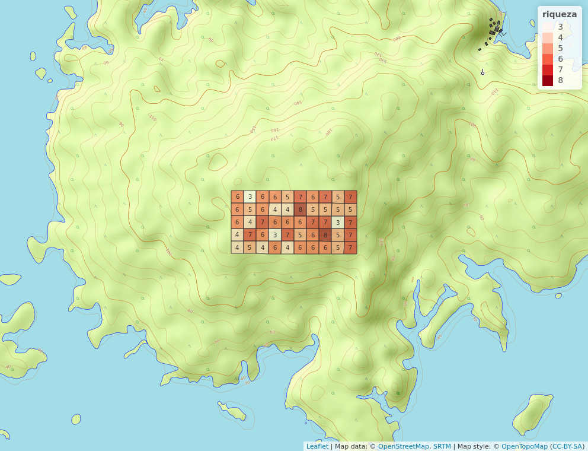

```{r, include=FALSE}
source("análisis.R", local = knitr::knit_global())
```


# Introducción

 Los censos o estudios de diversidad y abundancias de familias o especies  (fauna/flora) son de suma importancia ya que  nos ayudan a obtener información, recopilarla, analizar, comparar y evaluar, datos que puede ser publicados o usados como referencias para fines de investigación futura, lo que nos permite estudiar y conocer tasa de mortalidad, crecimiento, distribución, diversidad, ecológica de la población censada, diversidad, incluso estudios mas prufundos orientados al censo nos puede llevar a conocer perspectivas mas profundas de la poblacion censada que va mas ala de un simple conteo, tales como: asociacion de variables ambientales y como pueden o no provocar patrones en la poblacion cenada, como la geomorfologia puede influir en la abundancia y distribucion, tambien podemos conocer comportamientos de especies denominadas rarezas, digase poco abundantes o muy especialistas, entre otras cosas. Estas son solo algunas de las cosas que podemos obtener de un censo poblacional.
 
 La isla Barro Colorado, ubicada en el canal de Panamá, monumento natural protegido desde 1997, posee las condiciones perfectas para un sin número de estudios orientados a la flora o la fauna de dicho lugar,esto, combinado con las facilidades que el Instituto de investigaciones tropicales Smithsonian ofrece para los investigadores que deciden estudiar la isla, hacen una combinación perfecta.
 Se han realizados diferentes estudios, algunos para probar la la hipótesis de perturbación intermedia[@hubbell1999light], dinamica de bosque en esta zona[@condit1999dynamics], dianmica de biomas, entre otros interesantes estudios[@meyer2013detecting].

  Euphorbiaceae es una familia cosmopólita aunque con mayor concentración en regiones tropicales (Heywood, 1985),a menudo se les cita como una evolución convergente de las cactáceas por el parentesco que algunas especies presentan con esta familia.
Las Euphorbiaceae presentan una variedad de 17 modelos de crecimiento según los modelos de Halle, presentan características únicas, como una estructura que recubre las semillas de esta familia dejando fuera la idea de origen polifilético de las Euphorbiáceas.

Estudiaremos la presencia de esta familia en Barro Colorado desde la perspectiva de abundancia, riqueza, distribución y determinación de patrones, dígase posible tendencia de ordenación.
Para lograr esto, nos apoyaremos en datos que ofrece BCI, en especial, ecología numérica de las plantas. 
Esto contribuirá a la construcción de nuevas informaciones y saberes de esta familia,  distribución, factores ambientales de presencia ausencia y comportamiento en los micro hábitat o microclimas de la zona, etc.


 
\ldots

# Metodología

Los datos en los que se basa este trabajo se recopilaron por un grupo de investigadores en la Isla Barro Colorado 2010; trabajo que se inició hace 40 años (referencia de la fecha actual 2020), y solo presenta una pequeña porción de los inconmensurables estudios que se pueden llevar a cabo en este lugar. Realizaron un estudio de monitoreo a largo plazo de una parcela de bosque tropical de gran tamaño.

Según @condit1998tropical procedieron a montar una parcela dividida en 50 hectáreas. Esta posee alrededor de 250 mil tallos de unas 300 especies diferentes,  al cual se les sumo el censo de lianas que hasta el 2010 se conocian  56 mil individuos de unas 180 especies
Cada uno de los árboles en esta zona determinada que sobrepasan  10mm de diámetro será medido, marcado, mapeado y recensado cada 5 años con técnicas estandarizadas dispuestas a cualquier ciencia que quiera hacer uso de estas, ya sean ferring a distribuciones galácticas, secuencia de ADN o crecimiento de árboles o cualquier otra con la que se obtenga datos para un buen control del censo.[@condit1998tropical].

Los datos empelados en este trabajo, proceden de BCI la cual fue creada con la intención de examinar teorías ecológicas sobre el mantenimiento de una alta diversidad de especies (@condit1995mortality).

La organizacion de la parcela de 50 hectareas se proyevtan en el siguiente mapa que incluso toma en cuenta la elevacion.
 
 (Ver figura\ref{fig:mapa_cuadros}Organizacion de la parcela por cuadricula de una hectatrea 
 
 
 

\ldots

# Resultados

El censo de 2010 de la parcela permanente de la Isla Barro Colorado indica que la familia Euphorbiaceae consta con 10 especies y un total de 2421 individuos. La más rara, es decir, la menos abundante, fue  *Alchornea latifolia*, con un solo individuo, seguida de *Sapium broadleaf* con dos individuos. La más abundante fue *Acalypha diversifolia*, con 1023 individuos (ver tabla \ref{tab:tabla_de_abundancia} y figura \ref{fig:abun_sp_q}). La distribución de la riqueza y la abundancia por sitios es desigual, con 6 especies y ca. 50 individuos en promedio por cuadros de 1 Ha. Los valores mínimo y máximo de riqueza y abundancia por sitios muestran que se trata de una familia con mucha variabilidad en la parcela; en los cuadros 10, 17 y 43 se registraron tan sólo tres especies, mientras que en los cuadros 29 y 37 se registraron 8. Asimismo, la abundancia por cuadros fue muy variable, registrándose en el cuadro 2 el valor de abundancia mínima de 7 de individuos y un máximo de 162 individuos en el cuadro 50.

```{r, echo=FALSE}
knitr::kable(abun_sp,
             caption = "\\label{tab:tabla_de_abundancia}Abundancia por especie de la familia Euphorbiaceae")
```

Analizando la siguiente gráfica que nos indica la distribución y presencia de cada especie de Euphorbiaceae presente en esta zona de trabajo,en donde a mano izquierda están las especies encontradas y de forma longitudinal las 50 hectáreas.Lo que vemos es que *Acalypha diversifolia* ,  es la especie más abundante ya que  registró un muchos individuos por cuadros de esta especie seguido de *Croton billbergianus*.
Un dato más que nos arroja esta tabla es que estas mismas especies pueden coexistir ya que se les ve en algunas cuadrículas en las que ambas coinciden con una alta cantidad de individuos, estas cuadrículas corresponden a la 23 y a la 50, mismas que poseen la mayor riqueza global de la parcela  (ver figura\ref{fig:cuadro_riqueza_global}Riqueza global)Todo esto nos guia no solo a ver la riqueza por individuo si no que tambien por familia. 


```{r, echo=FALSE, fig.cap="\\label{fig:abun_sp_q}Abundancia por especie por quadrat (a la izquierda esta la lista de especies y a mayor intenso el color de la cuadricula, mayor es el numero de individuos"}
abun_sp_q
```

Continuando con  la abundancia, esta vez veámoslo desde la perspectiva de familias, el mapa que nos orienta nos da una ventaja y es que nos brinda la perspectiva de de las variaciones del relieve de la parcela.
Lo primero en resaltar es que las cuadrículas 23 y 50, las mismas que tiene el mayor número de especies(*cómo referenciar esa tabla*) y las que poseen mayor riqueza global, (ver figura\ref{fig:cuadro_riqueza_global}) resaltan una vez más, no son las que más poseen pero son de las que más poseen familias por cuadrículas con 6 y 7 familias de forma consecutiva.
La mayor abundancia de familias está presente en las cuadrículas 29 y 37 con 8 familias por cuadrículas, cabe destacar que aunque no sean continuas con relación a su posición, ambas entran en la categoría de bosque viejo en relieve alto (más adelante veremos esta y otras categorías con más detalle).
Esto abre una puerta a más variables determinantes  que influyen el la presencia, distribución y riqueza de las especies,esto se debe a que la variación del relieve, tipo de vegetación, influye directamente el clima, humedad, suelo, temperatura y muchos más factores que son imprescindibles para la presencia de ciertas especies, esto aplica para todo ser vivo, no de forma exclusiva a Euphorbiaceae.

(ver figura \ref{fig:cuadro_de_riqueza_familia})

{width=50%}


La riqueza global de la flora de barro colorado muestra una asosiacion entre la abundancia y las pendientes y zonas altas, mas que en las  zonas de transicion, segun el mapa de abundancia global.En las inclinaciones noroeste y una parte del este,se encuentran las cuadriculas con mayor cantidad de individuosy oxcialan desde los 4,500 a los 51014.Aun asi las demas cuadriclas muestran bastante presencia de individuos, todas las cuadriculas sobrepasan los 2,000,  especificamente en las zonas centricas de la parcela. A un asi, mas que determinar un patron, la aubundancia es bastante homogenea respecto a cada cudricula 
(puntos cardinales)

(ver figura\ref{fig:cuadro_riqueza_global})

{width=50%}

Comparando la abundancia global de nuestra familia de trabajo con la abundancia global de especies podemos notar lo siguiente, existe una asociación entre la abundancia global de especies y la abundancia global de Euphorbiaceae y la inclinación, ya que las cuadrículas con mayor cantidad de individuos también están situadas en la parte noroeste de la parcela y la parte este también.

(ver figura \ref{fig:cuadro_de_abundancia_global})

{width=90%} 

En cuanto a la abundancia de Euphorbiaceae, la a cuadrícula 50 es la que posee mayor cantidad de individuos seguido de la número 23 que se ubica en la parte céntrica de la parcela con 147 individuos. En el mapa de abundancia global se muestra el mismo patrón(ver figura \ref{fig:cuadro_de_abundancia_global}),
donde la cuadrícula 28 también situada de forma céntrica, es una de las cuadrículas con más individuos, 4,436 para ser exactos, lo que me permite llegar a la conclusión que la abundancia global de  Euphorbiaceae está asociada a la inclinación del relieve  y la abundancia global de especies.
Puede que haya un tercer factor ( altitud, nutrientes, tipo de suelo,microclima,etc) que determine la alta presencia de especies en esta zona y a la vez la alta presencia de Euphorbiaceae.

(ver figura\ref{fig:cuadro_abundancia_de_mi_familia})

{width=85%} 
  
En el análisis de correlación de la riqueza y la abundancia de Euphorbiaceae, sólo se detectó un patrón destacable: el contenido de hierro del suelo presenta relación positiva y significativa con la abundancia, no así con la riqueza. Son igualmente destacables, las significativas asociaciones negativas y positivas que existen entre distintas variables de suelo, aunque es común que múltiples variables de suelo interactúen entre sí (ver figura \ref{fig:suelo_ph_abun_riqu}) 
  

  
  
Viendo la riqueza y abundancia desde una perspectiva de heterogenidad ambiental, segun Pearson tomando en cuenta la geomorfologia y los que observamos es que hay avriables como la elevacion o la pendiente media  que muestran asociacion con muchas de las variables del analisi, pero los aspectos que nos interesan son relacion entre la abundancia y riqueza de Euphorbiacea con las demas variables del analisis, y como resultados tenemos que la abundancia de Euphorbiaceae 
muestra asociacion con la riqueza gobal de especies, al igual que con la pendiente media, geomorfologia de valle y la heterogenidad ambiental, mientras que la riqueza de nuestra familia solo muestra relacion con con la heterogenidad ambiental y a diferencia de la abundancia no muestra relacion alguna con la riqueza global.  
(Ver figura\ref{fig:geo_pearson})
  

  
Pero desde la perspectiva de Spearman solo la abundancia de nuestra familia es la que muestra reacion con las mismas variables que resalto el analisis de Pearson: riqueza gloal, geomorfologia valle y heterogenidad ambiental

(ver figura\ref{spearman})


MEDICIÓN ASOCIACIÓN

Lo que vemos a continuación es la interpretación visual de la matriz de distancia euclídea calculada a partir de la matriz de comunidad transformada por el método de Hellinger, revela que existen al menos tres clusters claramente diferenciados (ver figura\ref{fig:matriz_disimilaridad_hellinger}). Un clúster grande integrado por al menos 17 sitios (e.g. sitios 25, 32, 33, 37, 50). Un segundo cluster más pequeño de unos 4 sitios *el 41 va* (e.g. 10,8,42,49) y un terce cluster compuesto por las cuadriculas *36?*,28,27,45,6,48,44,34 y 39. (lea la  representación de cada color al pie de la gráfica para una mayor interpretación)
Para llegar a esta conclusión, se tomó en cuenta la distancia entre los sitios, dígase la disimilaridad (a mayor distancia, mayor disimilaridad), la cual se representa usando la métrica de la distancia euclídea(explica qué es), lo que equivale a una matriz de comunidad transformada, en este caso a una matriz de Hellinger, ésta se representará de forma gráfica en un mapa de calor con diversos colores, el 1er mapa no representa ningún orden, mientras que el 2do sí, facilitando así determinar patrones o grados de asociación.


(ver figura\ref{fig:diss_hellinger})


 
Los puntos x y x guardan asociación compartida en cuanto a sus especies compartidas, lo que significa que desde el punto de vista de Jaccard estos puntos están muy próximos.Lo mismo pasa con los puntos x x x xy x

En conclusión, la zona de trabajo muestra un 91.7% de similaridad o especies compartidas.

(Ver figura\ref{fig:diss_jaccard})


Estas es mas una matriz mixta ya que tomaremos en cuenta tanto variables cuantitativas como las cualitativas para nuestro análisis de distancia a partir de la heterogeneidad ambiental, dígase qué tan homogéneos son los micro hábitat en las cuadrículas o hectáreas, el tipo de hábitat y quebrada,presencia o ausencia de cañada (tabla de 3 columnas en nuestro script de análisi) 
Con relación a la topografía usaremos Old High (bosque viejo en relieve alto), Old Low(bosque en vertiente baja), Old Slope(bosque relieve bajo), Swamp(bosque en área encharcable) y Young(bosque joven).
Los resultados interpretados en base a la columna en el script y la matriz son:
Los niveles de heterogeneidad con respecto a microhábitat son bajos y pueden ir desde 0.0000 a 0.6368, lo que nos dice que existe una gran homogeneidad entre las microhábitat las hectáreas.
Con relación al hábitat, los más escasos son Swamp o bosque en área encharcable y Young o bosque joven, en 1ro solo se encuentra en las cuadrículas 23 y 18 lo que resulta razonable ya que ambas posiciones están contiguas de forma longitudinal en la parcela, mientras que young o bosque joven está en las cuadrículas 30 y 35 que al igual que la anterior, están de formas continuas de forma longitudinal(el 23 a la derecha del 15), puedes visitar la referencia 1 donde muestra la organización de la parcela por hectárea y ubicar estos puntos para entender mejor.
(Ver figura\ref{fig:mapa_cuadros}Organización de la parcela por cuadrícula de una hectárea)
Las cuadrículas que coinciden con Old Slope son :cuadrícula 1,5,16,21,26,36,41,42,43,44,45,46 y 50. Las cuadrículas 1 y 5 están en extremos opuestos, la 16 y 21 están contiguas de forma horizontal, lo mismo pasa con la 26 y 36 aunque estas tienen la cuadrícula 31 de por medio que posee un tipo de bosque diferente a estas, Ludlow para ser específicos, las 41,42,43,44,45 forman una una línea vertical con respecto a la hectárea teniendo a las cuadrículas 46 y 50 en cada extremo de esta línea, también resaltar que en las cuadrículas 1 y 50 hay presencia de quebrada.
Tipo de bosque Old High está presente en las cuadrículas 29,32,33,34,37,38,39 y 40, desde la 32 a la 34 están posicionadas de forma vertical, esta última con la 29 a su derecha y desde la 37 a la 40 también formas una línea vertical con respecto a la parcela.
EL tipo de bosque más abundante fue Hollow, tipo de bosque en vertiente bajo quebrada....

Debemos recordar que tanto abundancia como la riqueza de nuestra familia esta asociada a la heterogenidad ambiental segun la correlacion de Pearson.

hay cambios bruscos de tipo de bosque a pesar de la homogeneidad de la parcela??

(Ver figura\ref{fig:punt_z})


Una vez analizada la heterogeneidad, veamos el grado de asociación entre especie no sitio, o dicho de otra manera, presencia ausencia de especies a través de un cálculo de la distancia euclídea.

Esto se hace a través de una matriz transpuesta  usando datos de abundancia, para ver la posible asociación o patrones  las medidas o distancia de las especies. Cabe destacar que estos datos también se analizaron mediante la *Correlacion de Pirson*, usando una matriz de comunidad en modo R, donde dicha matriz se convirtió en datos binarios  y los resultados  "brutos" que arrojó mostraron consistencia, pero vemos  los resultados de esta y comparemos. 
 
(Ver figura\ref{fig:asoc_esp_no_sitio})


Lo primero que podemos resaltar es que esta matriz nos muestra que *Alchornea latifolia* no muestra asociación o cercanía con las demás especies, siendo así de las que más distancia muestra con relación a las especies,mientras que 
*Alcalypha macrostachya* es la que menor distancia guarda entre especies no sitio.
También nos muestra un cluster de especies que se correlacionan, guardando una gran cercanía entre sí, tales como *Hieronyma alchorneoides* con *Croton billbergianus*, esta última con *Acalypha diversifolia* etc. Aunque esto es de gran utilidad, una perspectiva que también nos es de gran utilidad es la correlación pero basada en nutrientes y elementos del suelo.


TECNICA DE ORDENACION NO RESTRINGIDA

Es importante ver si el ph y otros  elementos del suelo se correlaciona con nuestras especies, y esto podemos hacerlo a través de análisis de  PCA o análisis de componentes principales, CA o análisis de correspondencia y PCoA o análisis de coordenadas principales, cada una sus siglas en inglés.Estos nos servirán para ver el grado de asociación que guardan los sitio y elementos del suelo. Debemos recordar que la ordenación se basa también en la similaridad  y que su principal propósito es procurar reducir la dimensionalidad de los datos a través de un conjunto de técnicas, como representar datos en ejes ortogonales (comúnmente dos),donde el eje 1 explica la mayor varianza, el eje n explica la mínima, etc.


Comencemos por PCA en un modelo de vara quebrada, pero antes aclarar que la ordenación en este caso también se basa en la similaridad  y que su principal propósito es procurar reducir la dimensionalidad de los datos a través de un conjunto de técnicas, como representar datos en ejes ortogonales (comúnmente dos),donde el eje 1 explica la mayor varianza(la mayor cantidad de varianza posible en el menor número de ejes), el eje n explica la mínima, etc en este todas nuestras variables son  numéricas y comparables en cuanto a la escala de medición se refiere. los resultados obtenidos a través de este análisis de componentes principales son los siguientes: 


(ver figura\ref{fig:PCA_1})


Nuestro análisis de componente principal aplicado a la matriz de suelo nos dice que el componente PC1 es importante y el resultado que nos arroja es más de lo que se podría esperar para un modelo de vara quebrada, un poco más que el doble, y que aporta suficiente varianza para nuestra matriz, a diferencia de los demás componentes que no sobrepasan la vara quebrada lo que nos indica que esos componentes son pocos útiles ya que no consiguen explicar lo suficiente.

Viéndolo desde otra perspectiva, digase desde un Biplot, la correlación se vería de esta forma: Podemos interpretar los datos de la siguiente manera: la distancia euclídea está preservada en el escalamiento 1 y pH, P y N son los componentes de suelo más abundantes en este escalamiento, estos contribuyen mucho más en los componentes 1 y 2 y que en el resto de los componentes,dígase poco equitativo, mientras que los demás elementos o descriptores tiene una contribución para los demás los componentes más o menos homogénea para cada uno de los sitios . En el escalamiento 2(distancia de majala novis), el pH y el Nitrógeno guardan una relación con los sitios 31,35,3637,38,39,40, mientras que , minerales como el hierro (Fe) y el aluminio (Al),  están presente en casi el 50% de los sitios, siendos así muy parecidos en términos de suelo(negativo). Otros puntos a resaltar son que los elementos Cu, Mn, Fe están muy asociados, al igual que K y Zn, Ca,Mg Y N.min. lo que significa que cuando uno crece el otro también, a diferencia de B y Al o de P y Fe que cuando uno crece el otro disminuye porque no guardan relación entre sí en otras palabras una relación inversa.

Agrupamiento basados en la distancia euclídea con los datos escalados 


(ver figura\ref{fig:Biplot_pca1_pca2})


Aunque las escalas son diferentes, podríamos decir que el patrón se mantiene en ambos escalamientos ya que se presenta un agrupamiento de 3 cluster en ambos Biplot.
aquí puedes ver un el conjunto de cluster en función de los mismos datos de suelo, esta consistencia resulta razonable aunque los métodos de ordenación no sean los mismos ya que ambos se basan en la distancia euclídea.

(ver figura\ref{fig:cluster_pca})


Si aplicaramos en análisis de PCA para especies y no para variables obtendremos ;lo siguiente:
Nuestro modelo de vara quebrada quedaría de la siguiente manera: el componente 1 a diferencia que el de datos de suelo,este  tiene poco más de lo que se podría esperar para el modelo de vara quebrada, lo mismo pasa con el 2do componente pero en los demás no, siendo estos dos primeros imprescindibles para el análisis de la matriz de comunidad.Aun asi se podrian usar las primeras 4 o 5 componentes para una mayor comprensión.

(ver figura\ref{fig:quebrada_especie})


Viéndolo desde la perspectiva de diagrama de escalamiento o biplot, obtendremos lo siguiente: 
(ver figura\ref{fig:biplot_especie})


Es de esperarse que los patrones no coincidan con el diagrama de escalamiento anterior o biplot, y esto es porque las variables que se están tomando en cuenta son diferentes. Anteriormente se usaban elementos de suelo como descriptores y en este caso las especies de nuestra familia Euphorbiaceae. 
Podemos ver que *Acalypha diversifolia*, junto a *Croton billbergianis* y *Adelia triloba*, son las especies menos equitativas en los sitios de muestreo, cabe destacar que estas son más especialistas, mientras que las especies cuyos vectores no sobresalen de la circunferencia, con más generalistas.


Si correlacionar ambos análisis de PCA, tanto el de variables ambientales y suelo con el de las especies obtenemos los siguiente: la especie *Croton billbergianis* posee una estrecha relación con el aluminio, *Hura crepitans* con el Nitrógeno, *Acalypha diversifolis* también muestra cierta relación con el potasio (K); los elementos pH, N, B, Y K poseen una estrecha  relación entre sí, especialmente el B y el pH. mientras que el K y el Al tienen una relación inversa.

(ver figura\ref{fig:suelo_especie})


Si usamos solo las variables numéricas, obtendremos lo siguiente:
N, Ph, K, Al y B, siguen siendo variables significativas  que pueden explicar la distribución de especies,a las cuales se les suma Zn y Cu.
También las coordenadas UTM de este a oeste (UTM.EW) junto la  riqueza global se consideran variables significativas. En cuanto a la riqueza global, se refiere al  número de especie total por cuadro,la cual  está asociado a la matriz de comunidad como ya mencionamos, lo que significa que cuando aumenta el número de especies, este puede ayudar a interpretar cómo se distribuyen las especies dentro de la matriz de comunidad, dato que se manifesto al principio en la correlacion de Pearson.(Ver figura\ref{fig:geo_pearson}Correlacion de Pearson)

 (ver figura\ref{fig:variables_numericas})

 
 
Una vez visto este análisis, pasemos al CA, análisis de correspondencia, este es uno de los más usados y trata de llenar el vacío de las limitaciones del PCA ya que este nos permite usar datos de conteos aunque el CA no se puede aplicar a datos que no sean de frecuencias ya sea de abundancia o de presencia ausencia y no es necesario transponer las matrices. Está bien  mencionar que en este análisis no trabajamos con distancia Euclídea sino con la distancia ji-cuadrado.

Las distancias no van a coincidir del todo ya que se usan parámetros diferentes pero de todas formas puede que resalten patrones ya vistos en casos anteriores.
El escalamiento 1 muestra la distancia en función de sitios y el 2 la relación o distancia en función de especies.

Comencemos con el modelo de vara quebrada de nuestro CA, en este caso los componentes CA2 y CA3, son los que podrían representar la matriz de comunidad a diferencia de los demás modelos de vara quebrada donde el componente 1 era el más explícito a nuestra matriz de comunidad.De todas formas podemos usar las 4 primeras componentes para entender nuestra matriz de comunidad y de esa forma entender y resumir el conjunto de las multidimensiones de nuestra matriz de comunidad. Esto lo veremos mejor explicado en los siguientes gráficos.

(ver figura\ref{fig:AC})


Nuestros biplot del análisis de Correspondencia nos dicen lo siguiente: no tenemos vectores, en este caso solo hay espacios comunes que muestran la distribución y asociación. El biplot 1 o CA1 nos servirá para entender la similitud entre sitios y viendo el gráfico nos dice que un alto porcentaje de los sitios están más que relacionados,esto suele pasar cuando nuestras especies no suelen ser tan especialistas, no presentan patrones o tendencia muy clara. Hay unas 4 especies que rompen este patrón: *Adelia triloba*, *Alchornea latifolia*, *Acalypha macrostachya* y *Sapium broadleaf*, en especial las dos últimas, dándonos a entender que son especies algo más especialistas y de poca abundancia, esto podemos evidenciarlo en la tabla de de abundancia de especie por cuadrícula. (ver figura\ref{fig:abun_sp_q})


El biplot 2 nos servirá para ver la distancia entre especies, obtuvimos lo siguiente:
coincidiendo con el número 1, las especies guardan una cercanía considerable, dando a entender que su patrón de distribución podría ser homogéneo, aunque al igual que en el 1er biplot las especies *Adelia triloba*, *Alchornea latifolia*, *Acalypha macrostachya* y *Sapium broadleaf*, guardan una mayor distancia con relación al resto, en especial las dos últimas, evidenciandola consistencia entre los análisis.Las demás especies, por motivo de la estrecha distancia ji-cuadrado, nos indica que están correlacionadas entre sí.

En ambos biplots, *Croton billbergianus* guarda cierta distancia con relación a sitios y a especies, más en el 1er biplot que en el 2do, pero no tanto como las especies antes mencionadas.


(ver figura\ref{fig:biplot_ca})

 

Siguiendo con el  PCoA o análisis de componentes principales en espa;ol, este no usa la distancia euclídea ni la ji-cuadrada, lo que puede resultar algo incómodo ya que esto nos resultara en vectores de magnitudes negativas, imaginarias, dígase un vector complejo.Dicho vector no se podrá  aprovechar o representar como tal en el análisis de coordenadas principales porque no se podrá representar en los ejes del análisis.

Viendo los resultados de nuestro PCoA en el cual incluimos variables ambientales y geomorfológicas, obtenemos lo siguiente: las especies que muestran una contribución directa a sitios son, *Sapium broadleaf*  que contribuye a los sitios 36,24,43 y 45, *Alchornea latifolia* en el sitio 48 y *Adelia triloba* al sitio 19, aunque en la gráfica las demás especies contribuyen no se muestran directamente asociadas a un sitio en específico, estas contribuyen todos los sitios  de manera conjunta, también, las variables topográficas no muestras trascendencia en este análisis a excepción de la heterogeneidad ambiental, riqueza global y las coordenadas UTM de este a oeste (UTM.EW) que también se hacen presente en los análisis anteriores. 

Al igual que en los demás análisis, el Ph y el Nitrógeno (N) guardan cierta relación pero en este caso se muestran  una relación aún más estrecha.

(ver figura\ref{fig:PCoA})


TÉCNICA DE ORDENACIÓN RESTRINGIDA O CANÓNICA

En estas también integraremos variables ambientales o de suelo, especies y sitios, como variables explicativas, para determinar su integración, pero estas no tendrán la misma libertad de moverse a como lo hacían en la Teco no restringida ya que estos análisis posee restricciones por ajuste por medio de regresión lineal con respecto a la matriz ambiental, en otras palabras, buscaremos tendencias en una matriz de comunidad  restringida péndolas a una matriz ambiental. Esto lo haremos a través de 2 de los  principales análisis de la técnica de ordenación no restringida, estos serán: análisis de redundancia o RDA (siglas de *Redundancy Analysis*) Y análisis de correspondencia canónica o CCA (*canonical correspondence analysis*).

Comencemos por RDA que es el hermano canónico el PCA, este es una combinación de una  regresión lineal múltiple y el análisis de componentes principales dando como resultado múltiples variables de respuesta (multivariado).
En este la exploración de datos es explícita relacionada a dos matrices, una de respuesta y una explicativa, en donde   la matriz de respuesta equivale a la matriz de comunidad y la  matriz explicativa equivale a la variable ambiental.

Los resultados del RDA son los siguientes:
En el escalamiento uno lo que hace sentido es la distancia euclídea, por lo cual, lo resultante es un cúmulo de los sitios de forma cercana. y en el escalamiento 2 los ángulos entre especies y variables. El escalamiento 1 se vería de la siguiente manera:
A pesar de que los números están apiñados, podemos diferenciar ciertos clusters, por ejemplo:
los sitios 1,2,5,7,8,15 formas un pequeño cluster que muestra una asociación con el Al (aluminio), al igual que el 13,14,19, otro pequeño cluster asociado al Al y  46 y 47 muestran estrecha relación con P (fósforo), también las especies como *Hura crepitans*, *Acalypha diversifolia*,*Croton billbergianus*, entre otras, están muy bien explicadas en este escalamiento y bien representadas en los sitios contiguos al vector.

(ver figura\ref{fig:RDA1_euclidea})


Explicando la relación entre las variables explicativas en el escalamiento 2, obtendremos lo siguiente: Las variables Ca,B,N y Ph, muestran una estrecha relación entre sí, están presentes en los sitios 32,27 y 45 y que muestran una relación inversa con el aluminio (Al).Tenemos un segundo cluster de Mg, Zn y N.min.(nitrógeno mineralizado) con el Mg presente en el sitio 38,  el Fe y K también muestran cierta relación entre sí, en especial en los sitios 36,42,50, el Mn y el Cu también están relacionados entre sí y presentes en los sitios 31,43,44,48 y 49.

(ver figura\ref{fig:RDA})


También podemos añadir  las variables que presentaron asociación en el análisis pasivo de ordenación no restringida por PCA, y lo que vemos es que aunque no existe colinealidad de forma directa, algunas variables descriptivas forman ángulos bastante estrechos entre sí, indicando que son variables muy relacionadas.
Excluyendo variables asociadas al analisis PCA de ordenacion no restringida, basandonos en los valores VIF que estas poseen, el resultado es que: de cierta forma, el Al y el N.min poseen una relacion inversa, las variables descriptivas B, N y Ph estan relacionadas entre si de forma mas directa en los sitios 36, 39 y  44, mientras que el Cu no muestra asociacion directa a las demas variables explicativas pero si muestra constribucion a sitios como el 24,25,34,38,41,42 y 43.

(ver figura\ref{fig:PCA_RDA})


Desde la perspectiva del nuestro segundo análisis de ordenación restringida CCA, que es el hermano canonico del analisis de correspondencia.en este analisis se relazo un ajuste a las variables explicativas usando la distancia ji-cuadrado, de este tenemos los siguientes resultados: en este caso la relacion inversa del Al es con el N y el Ph, elementos que guardas una estrecha relacion entre si, formando un cluster junto al B. El N.min aporta de forma directa a las especies *Hura crepitans* y *Sapium broadleaf* per no muestra estrecha relacion con otras variables explicativas, lo mismo pasa con el Cu pero este aprota de forma mas directa a *Adelia triloba*, esta misma especie junto a *Acalypha diversifolia* simulan ser especies mienralizadas.

(ver figura\ref{fig:CCA})


Si mostraramos el mismo grafico pero sin especies "raras", tomano en cuenta que el  concepto raro en este caso esta aplicado a especies con menos de 100 individuos, asi se explicaria mejor o estaria menos cesgado los resultados con la distancia ji-cuadrado, tendiamos que nuestra presicion pasaria de 0.1273683  a 0.1739327 y los resulados muestran que en  este caso la relacion inversa del Al se muestra con el Cu y el N.min.,*Acalypha diversifolia* sigue estando asociada al Ph y de cierta forma aun guarda algun tipo de relacion con el N y el B.  

(ver figura\ref{fig:no_raras})


OJO PAMELA!!!  ( En resultados recuerda resaltar si la abundancia de especies de euphorbeacia resulta comun,("normla")en panamá  a pesar de ser intertropical, cuando su mayor distribucion es tropical)
 
 
RECORDATORIO: EL AJUSTE POST-HOC DEL ANÁLISIS DE ORDENACIÓN SUGIERE QUE LA VARIABLE pH (Y OTRAS) EXPLICA SIGNIFICATIVAMENTE LA COMPOSICIÓN DE ESPECIES DE EUPHORBIACEAE. AMPLIAR HACIA VARIABLES GEOMORFOLÓGICAS, UTILIZAR EL ANÁLISIS VIF PARA SELECCIONAR LAS VARIABLES EXPLICATIVAS Y, NO OLVIDES, QUE LA ORDENACIÓN RESTRINGIDA DEBERÍA SER CONSISTENTE CON ESTE ANÁLISIS.  RECORDAR EXPLICAR LA ASOCIACIÓN ENTRE SITIOS MEDIANTE EL GRÁFICO DE ESCALAMIENTO 1, LA RELACIÓN ENTRE VECTORES MEDIANTER ANGULO EN EL GRÁFICO DE ESCALAMIENTO 2.
 
 
 
 
 
 
 
 
 
 
 
 
 
 
 
 

\ldots

# Discusión

# Agradecimientos

# Información de soporte

\ldots

# *Script* reproducible

\ldots

# Referencias
