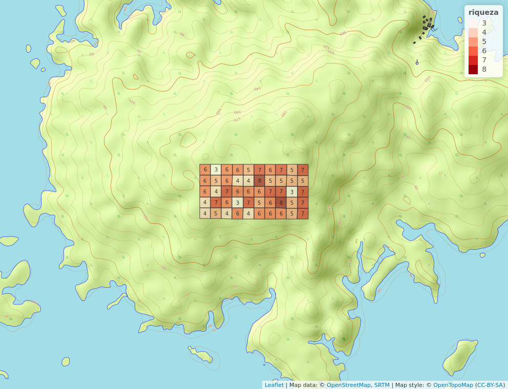

# Introducción

 Los censos o estudios de diversidad y abundancias de familias o especies  (fauna/flora) son de suma importancia ya que  nos ayudan a obtener información, copilarla, analizar, compara y evlaluar, datos que puede ser publicados o usados como referencias para fines de investigacion futura, lo que nos permite estudiar y conocer tasa de mortalidad, crecimiento, distribucion, diversidad, ecologia de la poblacion censada, entre otros aspectos........cómo contribuye al campo de estudio específico de tu temaa la ecología de plantas/bosque tropical).......
 
 La isla Barro Colorado, ubicada en el canal de Panamá, monumento natutal protegido desde 1997, posee las condiciones perfectas para un sin número de estudios orientados a la flora o la fanua de dicho lugar,esto, combinado con las facilidades que el Instituto de investigaciones tropicales Smithsonian ofrece para los investigadores que deciden estudiar la isla, hacen una combinación perfecta.

  Euphorbiaceae es una familia cosmopólita aunque con mayor concentración en regiones tropicales (Heywood, 1985),a menudo se les cita como una evolución convergente de las cactaceas por el parentezco que algunas especies presentan con esta familia.
Las Euphorbiaceae presentas una variedad de 17 modelos de creciemientos segun los modelos de Halle, presentas caracteristicas unicas, como una estructura que recubre las semillas de esta familia dejando fuera la idea de origen polifilético de las Euphorbiaceaes.

Estudiaremos la presencia de esta familia en Barro Colorado desde la perspectiva de abundancia, riqueza, distribución y determinación de patrones, dίgase posible tendencia de ordenación.
Para lograr esto, nos apoyaremos en datos que ofrece BCI, en especial, ecologίa numericde las plantas. 
Esto constribuira a la construccion de nuevas informaciones y saberes de esta familia,  distribucion, factores ambientales de pesencia ausencia y comportamiento en los micro habitad o micro climas de la zona, etc.
 

 
\ldots

# Metodología

Los datos en los que se basa este trabajo se recolpilaron por un grupo de investigadores en la Isla Barro Colorado 2010; tarbajo que se inicio hace 40 años (referencia de la fecha actual 2020), y solo presenta una pequeña porcion de los inconmensurables estudios que se pueden llevar a cabo en este lugar. Realizaron un estudio de monitoreo a largo plazo de una parcela de bosque tropical de gran tamaño.

Segun @condit1998tropical procedieron a montar una parcela dividida en 50 hectareas.Esta posee al rededor de 250mil tallos de unas 300 especies diferentes.
Cada uno de los arboles en esta zona determinada que sobrepasan  10mm de diametro seria medido, marcado, mapeado y recensado cada 5 años con tecnicas estandarizadas [@condit1998tropical]
 ........
 

\ldots

# Resultados

(Ver tabla \ref{tab:tabla_de_abundancia} y figura \ref{fig:abun_sp_q})

Table: \label{tab:tabla_de_abundancia}Abundancia por especie de la familia Euphorbiaceae

Latin                         n
------------------------  -----
Acalypha diversifolia      1023
Croton billbergianus        631
Alchornea costaricensis     316
Adelia triloba              143
Hieronyma alchorneoides     118
Hura crepitans               95
Acalypha macrostachya        52
Sapium glandulosum           40
Sapium broadleaf              2
Alchornea latifolia           1

 

(ver figura \ref{fig:cuadro_de_riqueza_familia}Riqueza por familia)

{width=50%}

  OJO PAMELA!!!  ( En resultados recuerda resaltar si la abundancia de especies de euphorbeacia resulta comun,("normla")en panamá  a pesar de ser intertropical, cuando su mayor distribucuin es tropical)
 

\ldots

# Discusión

# Agradecimientos

# Información de soporte

\ldots

# *Script* reproducible

\ldots

# Referencias
